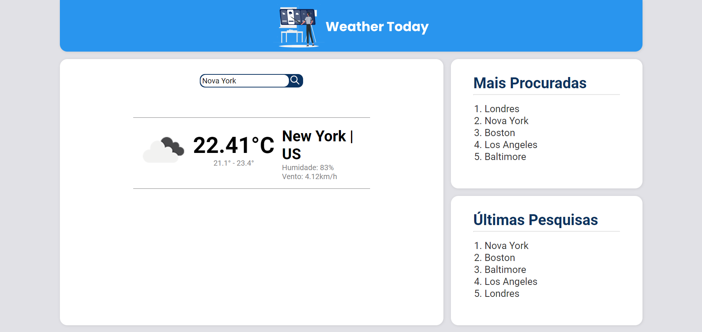

<h1>Weather Today</h1>

<h2>Pé visualização</h2>

É uma aplicação que apresenta o tempo em determinadas cidade situadas pelo mundo.

Para isso foi utilizado a API do <a href="https://openweathermap.org">OpenWeatherMap</a>.

  

<h2>Como executar</h2>

<h3>Vamos começar com o backend (API Node)</h3>

Entre na pasta backend, edite o arquivo .env.example renomeando para apenas .env após isso informe os campos necessários, o nome do banco de dados postgres (versão 10.18), seu usuários e sua senha. A API estará rodando na porta 3333.

Agora execute os seguintes comandos em sequência:

<pre>yarn install</pre>

<pre>yarn knex migrate:latest</pre>

<pre>yarn dev</pre>

<h3>Agora vamos executar o frontend (Aplicação ReactJs)</h3>

Entre na pasta frontend, edite o arquivo .env.example renomeando para apenas .env após isso informe o campo com sua chave do OpenWeatherMap API. A aplicação estará rodando na porta 3000.

Após isso execute os seguintes comandos em sequência:

<pre>yarn install</pre>

<pre>yarn start</pre>
